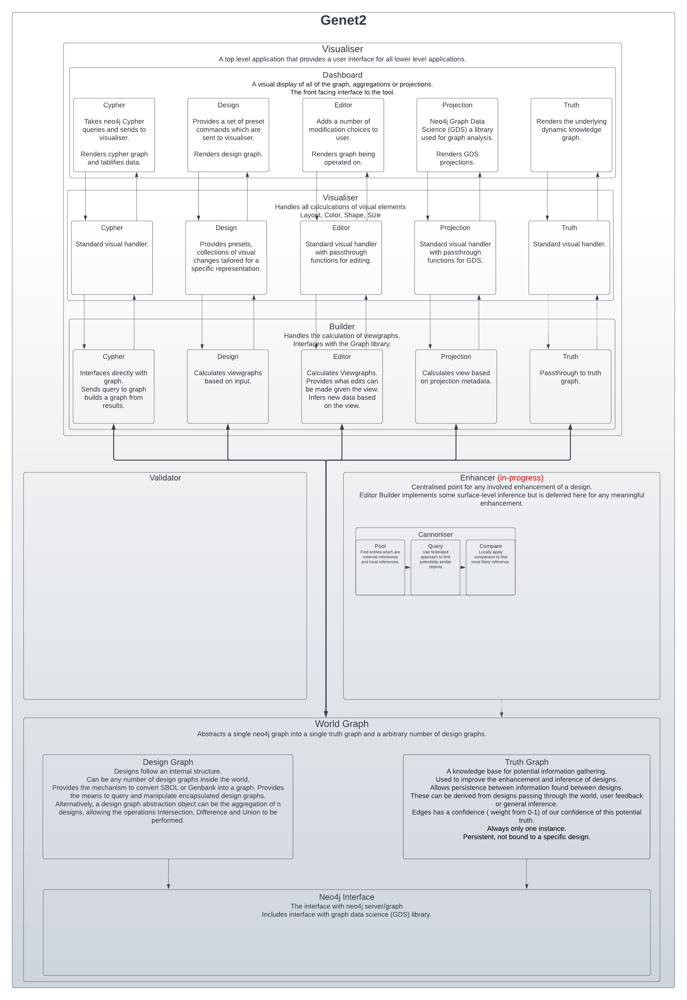

# Genetta
Genetta is a tool to represent genetic designs as networks. 
A network-centric approach provides several advantages, namely representing and analysing complex systems.
Furthermore, knowledge graphs have been widely used in biological sciences and are used here as the basis for structuring input data. 
The addition of semantics allows for more complex control over the underlying data, e.g., the ability to arrange information into several layers of abstraction.
Genetta currently aims to visualise genetic data as a network; we expand this to allow network-centric analysis primarily around enhancement and validation.
Please get in touch with us if you would like to contribute or if you would like to use the system (or sub-system) within your workflow.

## Installation
Genetta may be run in three ways depending on available resources.

### Fully Hosted
The local running is when both the Genetta server AND frontend are hosted externally.

### Partially Hosted
The partially hosted running is when the Genetta server is hosted externally and the frontend is ran locally.
#### Using Docker
1. Navigate to your install directory
2. `sudo chmod +x local.sh`
3. `./local.sh`
4. Open a browser and enter: http://127.0.0.1:5000/
5. The landing page has information for using the tool.
#### Without Docker
1. Navigate to your install directory
2. `python -m pip install -r requirements.txt`
3.  $ FLASK_APP=router.py python3 -m flask run
4.  Open a browser and enter: http://127.0.0.1:5000/
5.  The landing page has information for using the tool.

### Local
The local running is when both the Genetta server AND frontend are ran locally on the same machine.
#### Using Docker
1. Navigate to your install directory
2. `sudo chmod +x local.sh`
3. `./local.sh`
4. Open a browser and enter: http://127.0.0.1:5000/
5. The landing page has information for using the tool.
#### Without Docker
If docker is not available, here is a brief guide to installing neo4j with links to more comprehensive installation guides. 
Note this guide assumes a Debian based operating system.
* `$ git clone https://github.com/intbio-ncl/genet2`
*  Install Neo4j (https://neo4j.com/docs/operations-manual/current/installation/)
	1. `$ wget -O - https://debian.neo4j.com/neotechnology.gpg.key | sudo apt-key add -`
	2. `$ echo 'deb https://debian.neo4j.com stable latest' | sudo tee -a /etc/apt/sources.list.d/neo4j.list`
	3. `$ sudo apt-get update`
	4. `$ sudo apt-get install neo4j=1:4.4.6`
* Enable APOC (https://neo4j.com/labs/apoc/4.1/installation/)
	1. `$ mv NEO4J_HOME/labs/apoc-4.4.0.3-core.jar $NEO4J_HOME/plugins` (usually `mv /var/lib/neo4j/labs/apoc-4.4.0.3-core.jar /var/lib/neo4j/plugins`).
	2. `$ sudo neo4j restart`
* Install GDS (https://neo4j.com/docs/graph-data-science/current/installation/neo4j-server/)
	1. Download 'neo4j-graph-data-science-[version].jar' from the [Neo4j Download Center](https://neo4j.com/download-center/#algorithms)
	2. Copy it into the `$NEO4J_HOME/plugins` directory (usually `/var/lib/neo4j/plugins`).
	3. Add `dbms.security.procedures.unrestricted=gds.*` and `dbms.security.procedures.allowlist=gds.*` to `$NEO4J_HOME/conf/neo4j.conf` (usually `/var/lib/neo4j/conf/neo4j.conf`).
	4. `$ sudo neo4j restart`
* Install Python requirements.
	1. Navigate to your install directory
	2. `python -m pip install -r requirements.txt`
	3.  $ FLASK_APP=router.py python3 -m flask run
	4.  Open a browser and enter: http://127.0.0.1:5000/
	5.  The landing page has information for using the tool.

## Architecture
As discussed, Genetta uses neo4j for graph storage and manipulation. However, to present this, a small flask application using dash-Cytoscape has been implemented and enables the user-generated network visualisations. A graphic of the architecture can be seen below.

